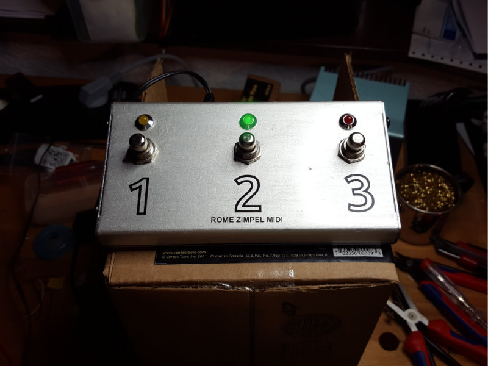
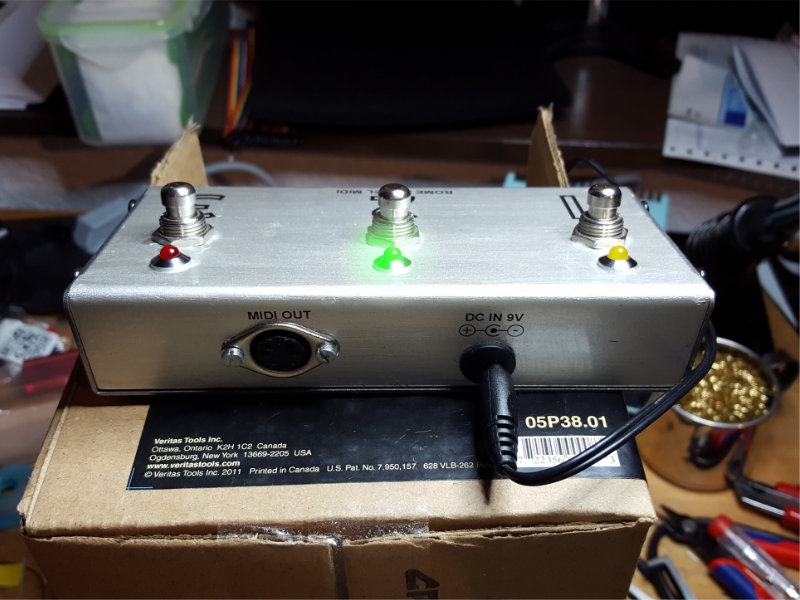
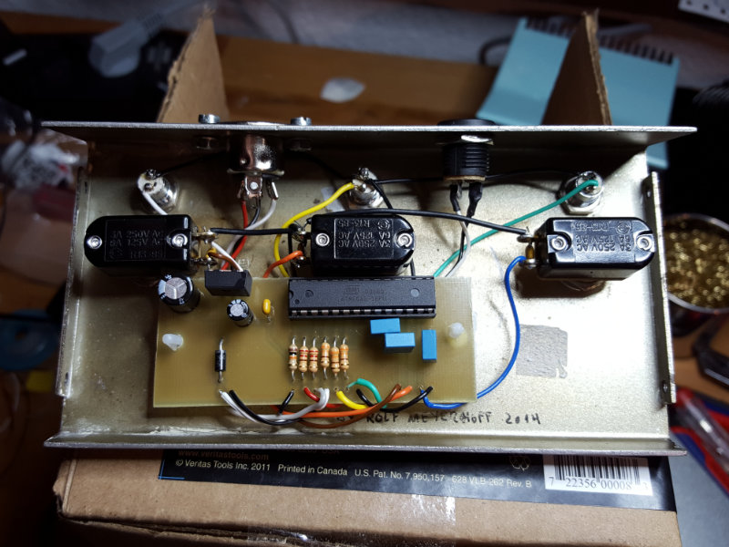

# RoMe Zimpel MIDI

This is a simple 3 button MIDI footswitch. It was designed to replace the huge original footswitch of my Marshall 6100LM with a smaller alternative. I've used the Digitech FS3X as base for the project as it's very cheap, sturdy and already comes with three latching footswitches. Drilling three holes for the LEDs and one for the MIDI socket makes it a great MIDI pedal.

The microcontroller used was the ATMEGA8 just because I had several of them flying around. It has a lot free IOs so the board could easily be extended with extra functionality (expression pedal, more buttons etc)

The schematic and board were created with KiCad, the code uses the default GNU toolchain for Atmel and avrdude. There are a gazillion websites out there that describe how to set this up on different operating systems so I will not go into depth here.

You might have to adjust the programmer (AVRDUDE_PROGRAMMER) and port (AVRDUDE_PORT) in the makefile to make the upload work on your system.

Usually a simple 'make all' in the code folder will be enough to build the binary. A 'make program' should upload the file to your Atmel.

The code itself is very minimalistic. Every button click creates a message on the serial port and turns the LED on.
